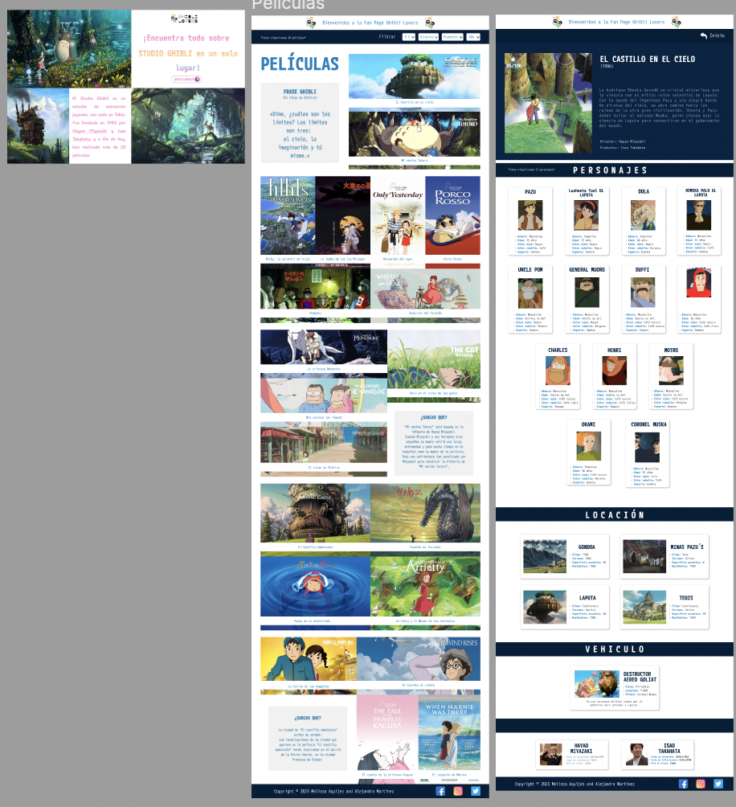

# Data Lovers

## Índice

* [1. Definición del producto](#1-definición-del-producto)
* [2. Historias de usuario](#2-resumen-del-proyecto)
* [3. Objetivos de aprendizaje](#3-objetivos-de-aprendizaje)
* [4. Consideraciones generales](#4-consideraciones-generales)
* [5. Criterios de aceptación mínimos del proyecto](#5-criterios-de-aceptación-mínimos-del-proyecto)
* [6. Interfaz de usuario](#6-hacker-edition)

***

## 1. Definición del producto
Studio Ghibli es considerado uno de los mejores estudios de animación a nivel mundial. Fundado en Japón en 1985, ha producido una impresionante colección de películas que transportan al espectador a mundos mágicos e imaginativos.

En nuestra página "Ghibli Lovers Fan Page", podrás explorar la filmografía de Studio Ghibli ademas de buscar y filtrar las películas según diferentes criterios, como año de lanzamiento o productor. De esta forma, podrás encontrar información detallada sobre cada película y conocer las maravillosas historias que hacen que el mundo Ghibli sea tan especial.

Ya sea que seas un fanático de Studio Ghibli de toda la vida o simplemente estés buscando una buena película para disfrutar, estamos seguros de que encontrarás algo que te encantará en nuestra colección de posters. Sumérgete en la magia de Studio Ghibli con nosotros y descubre por qué estas películas son tan queridas en todo el mundo. ¡Bienvenido a Ghibli Lovers Fan Page!

***

## 2. Historias de usuario

La creación de nuestra página se fundamentó principalmente en las opiniones y los comentarios realiazados en entrevistas con conocedores en el estudio, así como a personas comunes interesadas en su obra. Para recoplicar todos los comentarios y opiniones se craron "Historias de usuario" que resume y presenta las peticiones de los entrevistados con el fin comprender las necesidades y deseos de nuestros ususarios y mejorar la experiencia en nuestra pagina.

#### Historia Uno
- Yo cómo: Nuevo fan de Studio Ghibli.
- Quiero: Saber cuántas películas animadas hay y cuáles son.
- Para: Tener más conocimiento del contenido.
- Criterios de Aceptación:
    - Mostrar un mensaje de bienvenida.
    - Mostrar todas las películas con su respectiva imagen.
    - Mostrar un contador de la cantidad de las películas.
    - Insertar opciones para filtrar las películas alfabeticamente (A-Z) (Z-A).
- Definición de Terminado:
    - Crear un `<header>` para el mensaje de bienvenida.
    - Traer la data al `main.js`.
    - Mostrar la data en el `index.html`.
    - Incluir un `
` para el contador de películas y obtener el elemento por su id en el `main.js`.

#### Historia Dos
- Yo cómo: Nuevo fan de Studio Ghibli.
- Quiero: Saber quienes son los directores y productores de las animaciones y saber cuántas y cuáles son las animaciones a las que dieron "vida".
- Para: Tener más información de cada animación.
- Criterios de Aceptación:
    - Mostrar los directores.
    - Mostrar los productores.
    - Insertar un filtro y separar las películas según el director/productor seleccionado.
    - Mostrar el contador de películas según el director/productor seleccionado.
- Definición de Terminado:
    - Crear los filtros en el `main.js`
    - Generar un filtro general por director en el archivo `data.js` e importalo al `main.js`
    - Crear un `addEventListener` para que la data se filtre y se muestre en el `<html>` por director.
    - Generar un filtro general por productor en el archivo `data.js` e importarlo al `main.js`
    - Crear un `addEventListener` para que la data se filtre y se muestre en el `<html>` por productor.

#### Historia Tres
- Yo cómo: Usuario fan de Studio Ghibli.
- Quiero: Tener información relevante como descripción, fecha de lanzamiento, score, director, productor
y personajes de cada película.
- Para: Ser un fan que tiene más conocimiento de Studio Ghibli.
- Criterios de Aceptación:
    - Mostrar una descripción de cada película.
    - Mostrar la fecha de lanzamiento de cada película
    - Mostrar el score que tiene cada película.
    - Mostrar el director y productor.
    - Mostrar los personajes de cada película.
- Definición de Terminado:
    - Agregar contenedores en el `index.html` para poder crear una tercera página desde el `main.js`. 
    - Agregar con la data, la fecha de lanzamiento.
    - Agregar con la data, el score de cada pelicula.
    - Agregar con la data, la descripción de cada película.
    - Agregar con la data, el director y productor de cada película.
    - Mostrar los personajes con su nombre e imágen.
    - Crear un filtro en la página de posters, para que pueda ordenarlos por año (ascendente y descendente).

#### Historia Cuatro
- Yo cómo: Usuario fan de Studio Ghibli.
- Quiero: Saber cuántos y cuáles son los personajes de las animaciones.
- Para: Poder demostrar mi conocimiento a las personas que les interese los animes.
- Criterios de Aceptación:
    - Mostrar los personajes de cada pelicula (realizado en la HU anterior).
    - Mostrar un contador de la cantidad de personajes por película.
- Definición de Terminado:
    - Agregar al `main.js` un contador de personajes.

#### Historia Cinco
- Yo cómo: Usuario interesado en las películas animadas.
- Quiero: Saber que características tienen los personajes como: nombres, edad, género, especie, etc.
- Para: Obtener más conociminento de las animaciones.
- Criterios de Aceptación:
    - Mostrar los personajes y sus detalles como edad, género, especie, etc., de cada película.
- Definición de Terminado:
    - Agregarle al personaje sus detalles como edad, género, especie, color de ojos y de pelo.

#### Historia Seis
- Yo cómo: Usuario admirador de los paisajes y vehículos ilustrados o animados.
- Quiero: Saber cuáles son las locaciones y vehículos que tiene cada película.
- Para: Conocer como ilustraron en sus películas.
- Criterios de Aceptación:
    - Mostrar las locaciones de cada película.
    - Mostrar los vehículos utilizados en cada película.
- Definición de Terminado:
    - Crear en la tercera página cards con las locaciones y vehículos.
    - Por cada locación agregaremos su información como nombre, imagen, el clima, terreno, superficie de agua y habitantes.
    - Por cada vehículo agregaremos su información como nombre, imagen, descripción, clase, longitud y piloto.    

## 3. Prototipo de baja fidelidad

## 4. Prototipo de alta fidelidad

## 5. Test de usabilidad
A travez de la retroalimentación rebibida de nuestros usuarios se creo una lista con los posibles cambios o incovenientes de la pagina. Gracias a la lista se realizaron los cambios necesarios en nuestra pagina para asegurarnos de que la experiendia sea lo mas gratificante posible para el usuario.

A continuación presentamos una lista que resumen las criticas que recibimos de nuestros usuarios:

####
- Reorganizar los poster de forma simetrica para mejorar la visualización de la pagina principal.
- Cambiar los colores de la pagina de incio para que coincida con la pagina principal.
- Eliminar las tarjetas de los productores y directores para  evitar repetir la información ya mencionada.
- Usar colores oscuros para las paginas descripctivas, de esta forma homogenizar el diseño.
- Añadir un boton que invite a ver la descripción de las peliculas.
- Cambiar el titulo insertado en los posters ubicados en la pagina princiapal, para que sea mas consistente y facil de visulaizar cada poster

## 6. Interfaz de usuario
¡Gracias por visitar nuestra página, descubre por que estas películas son tan queridas y disfruta explorando de la magia de Studio Ghibli con nosotros!

